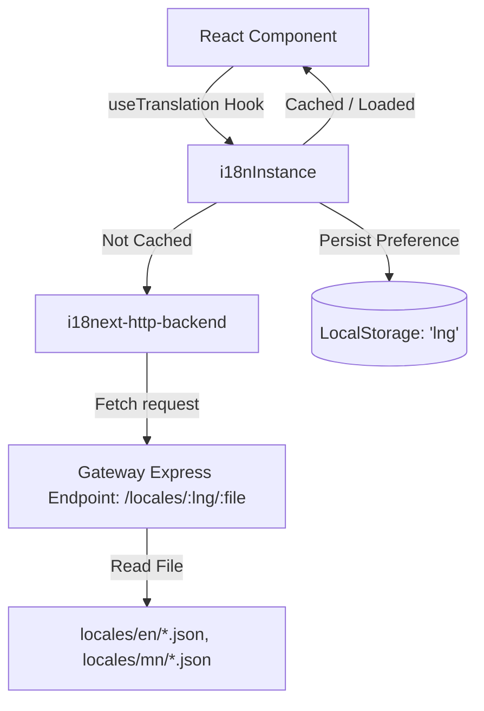

# Translation Architecture Analysis

This document provides a technical analysis of how internationalization (i18n) and translations are implemented in this repository.

---

## 1. Architecture Overview

The translation architecture is client-side driven with backend-assisted dynamic loading.

*   **Front-End React Application**: Uses `i18next` and `react-i18next` to translate text strings.
*   **Decoupled Assets**: Translations are not bundled into the front-end code. Instead, they are retrieved on-demand from the gateway using `i18next-http-backend`.
*   **Back-End API Gateway**: Serves static translation JSON files via an Express endpoint, including safety checks to prevent directory traversal.



---

## 2. Front-End Translation Setup

The front-end internationalization is concentrated within the `frontend/core-ui/src` directory.

### A. Main Configuration
The core setup resides in [config.ts](file:///Users/Amaraa0404/Documents/projects/erxes-4.0/frontend/core-ui/src/i18n/config.ts):
*   **Supported Languages**: Currently supports English (`en`) and Mongolian (`mn`).
*   **Dynamic Load Path**: Uses `i18next-http-backend` to pull translations from the gateway:
    ```typescript
    loadPath: `${REACT_APP_API_URL}/locales/{{lng}}/{{ns}}.json`
    ```
*   **Namespaces**: Translations are split into separate modules (namespaces) to optimize load size:
    *   `common` (default namespace)
    *   `contact`
    *   `product`
    *   `documents`
    *   `organization`
    *   `segment`
    *   `automations`
    *   `settings`
    *   `broadcasts`
*   **Persistence**: Language preferences are persisted in `localStorage` under the key `'lng'`.

### B. React Context Provider
The React context is initialized using the `AppI18nWrapper` inside [i18next-provider.tsx](file:///Users/Amaraa0404/Documents/projects/erxes-4.0/frontend/core-ui/src/providers/i18next-provider/i18next-provider.tsx):
```typescript
import { I18nextProvider } from 'react-i18next';
import { i18nInstance } from '../../i18n';

export const AppI18nWrapper = ({ children }: React.PropsWithChildren) => {
  return <I18nextProvider i18n={i18nInstance}>{children}</I18nextProvider>;
};
```
This wrapper is integrated at the root level of the application within `App.tsx` to provide translation support to all components.

### C. Language Utilities and Hooks
*   **Language Switch Hook**: The [useSwitchLanguage.tsx](file:///Users/Amaraa0404/Documents/projects/erxes-4.0/frontend/core-ui/src/i18n/useSwitchLanguage.tsx) hook exposes current language status, supported languages, and a switcher function:
    ```typescript
    export const useSwitchLanguage = () => {
      return {
        currentLanguage: i18nInstance.language,
        languages: i18nInstance.options.supportedLngs || [],
        switchLanguage: (languageId: AvailableLanguage) =>
          i18nInstance.changeLanguage(languageId),
      };
    };
    ```
*   **Metadata**: The [languages.ts](file:///Users/Amaraa0404/Documents/projects/erxes-4.0/frontend/core-ui/src/i18n/languages.ts) file defines language configurations including `date-fns` locales for date handling.

---

## 3. Back-End Server Asset Pipeline

The translations are hosted on the gateway service.

### A. Asset Locations
Translations are organized in JSON files under the [locales](file:///Users/Amaraa0404/Documents/projects/erxes-4.0/backend/gateway/src/locales) directory:
*   `/backend/gateway/src/locales/en/` — English translations.
*   `/backend/gateway/src/locales/mn/` — Mongolian translations.

Each directory contains namespace-specific files such as `automations.json`, `settings.json`, and `common.json`.

### B. Express Gateway Route
The file [main.ts](file:///Users/Amaraa0404/Documents/projects/erxes-4.0/backend/gateway/src/main.ts) in the gateway service serves translation JSON files:
```typescript
app.get('/locales/:lng/:file', async (req, res) => {
  const localesRoot = path.join(__dirname, './locales');
  try {
    const requestedPath = path.resolve(
      localesRoot,
      req.params.lng,
      req.params.file,
    );
    const realPath = fs.realpathSync(requestedPath);
    if (!realPath.startsWith(localesRoot + path.sep)) {
      return res.status(403).send('Forbidden');
    }
    const lngJson = fs.readFileSync(realPath);
    res.json(JSON.parse(lngJson.toString()));
  } catch {
    res.status(500).send('Error fetching locale');
  }
});
```

*   **Security Feature**: This route uses `path.resolve` and `fs.realpathSync` followed by a prefix check (`!realPath.startsWith(localesRoot + path.sep)`) to block directory traversal attacks.

---

## 4. Front-End Usage Pattern

Components access translations by invoking the standard `useTranslation` hook from `react-i18next`.

### Example
In `AutomationBuilderUnsavedChangesAlert.tsx`:
```typescript
import { useTranslation } from 'react-i18next';

export const AutomationBuilderUnsavedChangesAlert = () => {
  // Specify the namespace to load/use
  const { t } = useTranslation('automations');

  return (
    <AlertDialog.Title>{t('unsaved-changes-title')}</AlertDialog.Title>
  );
};
```

---

## 5. Architectural Recommendations

1.  **Layout Direction in Mongolian Settings**: In [languages.ts](file:///Users/Amaraa0404/Documents/projects/erxes-4.0/frontend/core-ui/src/i18n/languages.ts), Mongolian (`mn`) is marked as `ltr: false`. Standard Cyrillic Mongolian is written left-to-right (LTR). This configuration key should be verified.
2.  **Namespace Alignment**: There is a `templates.json` file in the locales directory which is not declared in the static `ns` list inside `config.ts`. If dynamically required, it should be registered.
